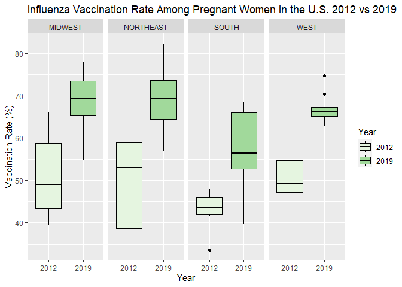

Midterm
================
CB
2022-10-22

# **Title: Influenza Vaccine Uptake by Region and Age Group from 2012-2019 in the United States**

## **Introduction: Pregnant women and newborns are at higher risk for severe illness from Influenza virus infection(Ref). Influenza during pregnancy can lead to severe maternal respiratory illness requiring hospitalization. It can also be a serious condition for infants (babies under 1 year of age), especially during the neonatal period (first 30 days of life) and for those with pre-existing respiratory conditions such as bronchopulmonary dysplasia (Ref). The yearly influenza vaccine has a long track record of safety and efficacy during pregnancy and is recommended by the Centers for Disease Control (CDC) for all pregnant women (Ref). Despite this recommendation, only approximately 50% of women receive the influenza vaccine during pregnancy (ref). The objective of this qualitative data analysis is two fold, first to examine factors associated with low vaccine uptake. Specifically, age group and location. Second, to examine these trends over time to see whether uptake is increasing or decreasing. Identifying those pregnant women less likely to get vaccinated can help inform where efforts to promote vaccine utilization are needed most.**

``` r
library(data.table)
library(dplyr)
```

    ## 
    ## Attaching package: 'dplyr'

    ## The following objects are masked from 'package:data.table':
    ## 
    ##     between, first, last

    ## The following objects are masked from 'package:stats':
    ## 
    ##     filter, lag

    ## The following objects are masked from 'package:base':
    ## 
    ##     intersect, setdiff, setequal, union

``` r
library(tidyverse)
```

    ## ── Attaching packages
    ## ───────────────────────────────────────
    ## tidyverse 1.3.2 ──

    ## ✔ ggplot2 3.3.6     ✔ purrr   0.3.4
    ## ✔ tibble  3.1.8     ✔ stringr 1.4.1
    ## ✔ tidyr   1.2.0     ✔ forcats 0.5.2
    ## ✔ readr   2.1.2     
    ## ── Conflicts ────────────────────────────────────────── tidyverse_conflicts() ──
    ## ✖ dplyr::between()   masks data.table::between()
    ## ✖ dplyr::filter()    masks stats::filter()
    ## ✖ dplyr::first()     masks data.table::first()
    ## ✖ dplyr::lag()       masks stats::lag()
    ## ✖ dplyr::last()      masks data.table::last()
    ## ✖ purrr::transpose() masks data.table::transpose()

``` r
library(leaflet)
library(dtplyr)
library(knitr)
library(ggplot2)
```

``` r
library(readr)
Vaccination_Coverage_among_Pregnant_Women_3_ <- read_csv("C:/Users/clair/Desktop/PM566/Vaccination_Coverage_among_Pregnant_Women (3).csv", 
    col_types = cols(`Survey Year_Influenza Season` = col_integer(), 
        Estimate = col_number(), `95CI` = col_skip(), 
        `Sample Size` = col_number()))
```

    ## Warning: One or more parsing issues, see `problems()` for details

``` r
vaxdata<-Vaccination_Coverage_among_Pregnant_Women_3_
dim(vaxdata)
```

    ## [1] 3621    8

``` r
head(vaxdata)
```

    ## # A tibble: 6 × 8
    ##   Vaccine   `Geography Type` Geography Survey …¹ Dimen…² Dimen…³ Estim…⁴ Sampl…⁵
    ##   <chr>     <chr>            <chr>         <int> <chr>   <chr>     <dbl>   <dbl>
    ## 1 Influenza States           Alaska         2012 Age     >=18 Y…    49.2     852
    ## 2 Influenza States           Arkansas       2012 Age     >=18 Y…    46.6     756
    ## 3 Influenza States           Colorado       2012 Age     >=18 Y…    56.1    1170
    ## 4 Influenza States           Delaware       2012 Age     >=18 Y…    41.6     981
    ## 5 Influenza States           Georgia        2012 Age     >=18 Y…    33.6    1007
    ## 6 Influenza States           Hawaii         2012 Age     >=18 Y…    42      1385
    ## # … with abbreviated variable names ¹​`Survey Year_Influenza Season`,
    ## #   ²​`Dimension Type`, ³​Dimension, ⁴​Estimate, ⁵​`Sample Size`

``` r
unique(vaxdata$Vaccine)
```

    ## [1] "Influenza" "Tdap"

``` r
unique(vaxdata$'Geography Type')
```

    ## [1] "States"   "National"

``` r
unique(vaxdata$Geography)
```

    ##  [1] "Alaska"               "Arkansas"             "Colorado"            
    ##  [4] "Delaware"             "Georgia"              "Hawaii"              
    ##  [7] "Illinois"             "Maine"                "Maryland"            
    ## [10] "Massachusetts"        "Michigan"             "Minnesota"           
    ## [13] "Missouri"             "Nebraska"             "New Jersey"          
    ## [16] "New Mexico"           "NY-City of New York"  "Ohio"                
    ## [19] "Oklahoma"             "Oregon"               "Pennsylvania"        
    ## [22] "United States"        "Rhode Island"         "Tennessee"           
    ## [25] "Utah"                 "Vermont"              "Washington"          
    ## [28] "West Virginia"        "Wisconsin"            "Wyoming"             
    ## [31] "New York"             "Iowa"                 "New Hampshire"       
    ## [34] "NY-Rest of state"     "Alabama"              "Connecticut"         
    ## [37] "Louisiana"            "Texas"                "Virginia"            
    ## [40] "Kansas"               "Kentucky"             "Montana"             
    ## [43] "North Carolina"       "North Dakota"         "Puerto Rico"         
    ## [46] "South Dakota"         "District of Columbia" "Indiana"             
    ## [49] "Mississippi"          "Florida"

``` r
unique(vaxdata$'Survey Year_Influenza Season')
```

    ## [1] 2012 2013 2014 2015 2016 2017 2018 2019

``` r
unique(vaxdata$'Dimension Type')
```

    ## [1] "Age"            "Race/Ethnicity"

``` r
unique(vaxdata$Dimension)
```

    ## [1] ">=18 Years"                           
    ## [2] "18-24 Years"                          
    ## [3] "25-34 Years"                          
    ## [4] ">=35 Years"                           
    ## [5] "Black, Non-Hispanic"                  
    ## [6] "Hispanic"                             
    ## [7] "Other or Multiple Races, Non-Hispanic"
    ## [8] "White, Non-Hispanic"

``` r
vaxdata1<-subset(vaxdata, `Dimension Type`=="Age")
table(vaxdata1$'Dimension Type')
```

    ## 
    ##  Age 
    ## 1824

``` r
colSums(is.na(vaxdata1))
```

    ##                      Vaccine               Geography Type 
    ##                            0                            0 
    ##                    Geography Survey Year_Influenza Season 
    ##                            0                            0 
    ##               Dimension Type                    Dimension 
    ##                            0                            0 
    ##                     Estimate                  Sample Size 
    ##                           15                            0

``` r
vaxdata1<-vaxdata1 %>% drop_na(Estimate)
```

``` r
dim(vaxdata1)
```

    ## [1] 1809    8

``` r
vaxdata_DT=as.data.table(vaxdata1)
is.data.table(vaxdata_DT)
```

    ## [1] TRUE

``` r
summary(vaxdata_DT$Estimate)
```

    ##    Min. 1st Qu.  Median    Mean 3rd Qu.    Max. 
    ##    7.70   51.30   60.70   59.87   70.30   91.80

``` r
vaxdata_DT_region <-vaxdata_DT [, region := fifelse(Geography== "Alaska"| Geography=="Arizona" | Geography=="California" | Geography=="Colorado"| Geography=="Hawaii"| Geography=="Idaho"| Geography=="Montana"| Geography=="Nevada"| Geography=="New Mexico"| Geography=="Oregon"| Geography=="Utah"| Geography=="Washington"|Geography== "Wyoming", "WEST",
                fifelse(Geography=="Alabama"|Geography=="Arkansas"|Geography== "Delaware" |Geography== "District of Columbia"| Geography=="Florida"|Geography== "Georgia" | Geography=="Kentucky" |Geography== "Louisiana"|Geography== "Maryland" | Geography=="Mississippi" |Geography=="North Carolina"|Geography=="Oklahoma"| Geography=="South Carolina"| Geography=="Tennessee" |Geography=="Texas"|Geography== "Virginia"|Geography== "West Virginia", "SOUTH",
                fifelse(Geography=="Illinois"| Geography=="Indiana"| Geography=="Iowa"|Geography== "Kansas"| Geography=="Michigan"|Geography== "Minnesota"| Geography=="Missouri"| Geography=="Nebraska"| Geography=="North Dakota"| Geography=="Ohio"|Geography=="South Dakota"|Geography=="Wisconsin", "MIDWEST",
                fifelse(Geography=="Puerto Rico"|Geography=="United States", "",
                        "NORTHEAST"))))]
```

``` r
table(vaxdata_DT_region$region)
```

    ## 
    ##             MIDWEST NORTHEAST     SOUTH      WEST 
    ##        80       408       526       440       355

``` r
vaxdata_DT_region<-as.data.table(vaxdata_DT_region)
is.data.table(vaxdata_DT_region)
```

    ## [1] TRUE

``` r
vaxdata_DT_region<-subset(vaxdata_DT_region, `region`!="")

table(vaxdata_DT_region$region)
```

    ## 
    ##   MIDWEST NORTHEAST     SOUTH      WEST 
    ##       408       526       440       355

``` r
unique(vaxdata_DT_region$"Survey Year_Influenza Season")
```

    ## [1] 2012 2013 2014 2015 2016 2017 2018 2019

``` r
mean(vaxdata_DT$Estimate)
```

    ## [1] 59.87424

``` r
vaxdata1<-vaxdata1 %>% rename(Year="Survey Year_Influenza Season")
vaxdata1<-vaxdata1 %>% rename(Age= "Dimension")
tail(vaxdata1)
```

    ## # A tibble: 6 × 8
    ##   Vaccine `Geography Type` Geography      Year Dimension…¹ Age   Estim…² Sampl…³
    ##   <chr>   <chr>            <chr>         <int> <chr>       <chr>   <dbl>   <dbl>
    ## 1 Tdap    National         United States  2019 Age         >=35…    77.6    4447
    ## 2 Tdap    States           Utah           2019 Age         >=35…    72.6     270
    ## 3 Tdap    States           Vermont        2019 Age         >=35…    87.8     153
    ## 4 Tdap    States           Virginia       2019 Age         >=35…    81.6     224
    ## 5 Tdap    States           Washington     2019 Age         >=35…    84.9     254
    ## 6 Tdap    States           Wisconsin      2019 Age         >=35…    72.6     133
    ## # … with abbreviated variable names ¹​`Dimension Type`, ²​Estimate,
    ## #   ³​`Sample Size`

``` r
vaxdata1<-distinct(vaxdata1)
```

``` r
vaxdata1%>%
  filter(Geography=="United States", Vaccine == "Influenza", Age !=">=18 Years") %>% 
  ggplot(aes(x=Year, fill= Age, y=Estimate)) +   
  geom_col(color="black", position="dodge")+
  labs(title="Influenza Vaccination Rate Among Pregnant Women in the U.S. 2012-2019", x="Year", y= "Vaccination Rate (%)")+
scale_fill_brewer(palette = "Blues")
```

<!-- -->

``` r
vaxdata1%>%
  filter(Geography=="United States", Vaccine == "Tdap", Age !=">=18 Years") %>% 
  ggplot(aes(x=Year, fill= Age, y=Estimate)) +   
  geom_col(color="black", position="dodge")+
  labs(title="Tdap Vaccination Rate Among Pregnant Women in the U.S. 2012-2019", x="Year", y= "Vaccination Rate (%)")+
scale_fill_brewer(palette = "Purples")
```

<!-- -->

``` r
vaxdata_DF_region <- as.data.frame(vaxdata_DT_region)
```

``` r
vaxdata_DF_region%>%
  filter(Geography!="United States" & Geography != "Puerto Rico", Vaccine == "Influenza", Dimension ==">=18 Years", `Survey Year_Influenza Season` ==2019) %>% 
  ggplot(aes( fill=  region, y=Estimate)) +   
  geom_boxplot(color="black")+
  labs(title="Influenza Vaccination Rate Among Pregnant Women in the U.S. 2019",  y= "Vaccination Rate (%)")+
scale_fill_brewer(palette = "Reds")+
  facet_wrap(~ region, nrow = 1)
```

<!-- -->

``` r
vaxdata_DF_region%>%
  filter(Geography!="United States" & Geography != "Puerto Rico", Vaccine == "Influenza", Dimension ==">=18 Years", `Survey Year_Influenza Season` ==2012) %>% 
  ggplot(aes( fill=  region, y=Estimate)) +   
  geom_boxplot(color="black")+
  labs(title="Influenza Vaccination Rate Among Pregnant Women in the U.S. 2012",  y= "Vaccination Rate (%)")+
scale_fill_brewer(palette = "Reds")+
  facet_wrap(~ region, nrow = 1)
```

<!-- -->

``` r
vaxdata_DF_region<-vaxdata_DF_region %>% rename(Year="Survey Year_Influenza Season")
vaxdata_DF_region$Year <-as.character(vaxdata_DF_region$Year)
```

``` r
vaxdata_DF_region%>%
  filter(Geography!="United States" & Geography != "Puerto Rico", Vaccine == "Influenza", Dimension ==">=18 Years", Year == 2012 | Year == 2019) %>% 
  ggplot(aes(y=Estimate, x = Year, fill = Year)) +   
  geom_boxplot(color="black")+
  labs(title="Influenza Vaccination Rate Among Pregnant Women in the U.S. 2012 vs 2019",  y= "Vaccination Rate (%)")+
scale_fill_brewer(palette = "Greens")+
  facet_wrap(~region, nrow=1)
```

<!-- -->
